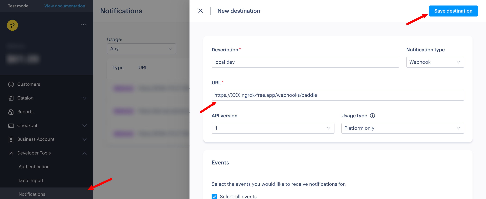

# Paddle

To handle payments, we'll use Paddle, a merchant of record (MOR) that allows you to sell your products and services online.

Start by creating an account on the [Paddle website](https://paddle.com/).

## Local Development

In order to get paddle to work locally, sign up for an account on their [sandbox environment](https://sandbox-login.paddle.com/). The process should be instant and will allow you to test paddle without making real transactions.

Since we rely on Paddle's webhooks, you'll need to setup [ngrok](https://ngrok.com/). Once you have ngrok installed, run the following command:

```bash
ngrok http 3000
```

This will create a tunnel to your local server. Copy the URL and add it to the Paddle webhook settings.

1. In the sandbox dashboard, go to the `Developer Tools > Notifications` section.

2. Create a new destination and set the URL `http://your-ngrok-url/webhooks/paddle`.

:::note
The free version of ngrok will generate a new URL every time you restart the server. You'll need to update the webhook URL in the Paddle dashboard every time you restart ngrok.
:::

3. Select all the events and save the destination.



4. Copy the webhook secret key and add it to your `.envrc` as the `PADDLE_WEBHOOK_SECRET` key

5. To get your Paddle API key, go to `Developer Tools > Authentication` and generate a new API key. Copy it and add it to your `.envrc` as the `PADDLE_API_KEY` key.

6. In order for the frontend to communicate with Paddle, you'll need a client-side token. Go to `Developer Tools > Authentication` and generate a new client-side token. Copy it and add it to your `.envrc` as the `VITE_PADDLE_AUTH_TOKEN` key.

## Production

Once your Paddle account is approved for production, repeat the same steps as above in the production dashboard.

When you go to create a new destination, the webhook URL to point to your production server. The URL should be

```
https://api.domain.com/prod/webhooks/paddle
```

Add the `PADDLE_WEBHOOK_SECRET` and `PADDLE_API_KEY` to `pulumi/stack-vars.yml` and run `pulumi up` to deploy the changes.

Make a client-side token for the production environment and add it to the Netlify environment variables as `VITE_PADDLE_AUTH_TOKEN`.

## Setting up products and prices

To create a new product, go to the `Catalog > Products` section in the Paddle dashboard.

Then create two prices, one for the Hobby plan and one for the Pro plan.

Set the type to "Recurring", and set the billing period to "Monthly".

Make sure to set the Product Quantity Limit to minimum 1 and maximum 1, so that users can only purchase one subscription.

Once you've created the products, copy the price IDs to the following files

- `src/server/graphql/types/subscription.ts`
- `src/frontend/src/pages/plan.tsx`
